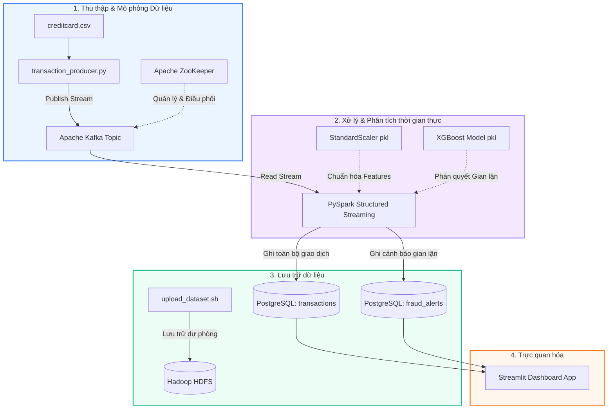

# 🛡️ Real-Time Credit Card Fraud Detection in Mobile Banking

Dự án này là hệ thống phát hiện giao dịch gian lận thẻ tín dụng thời gian thực sử dụng kiến trúc dữ liệu lớn (Big Data) kết hợp với các mô hình Học máy (Machine Learning). Hệ thống tích hợp khả năng xử lý luồng dữ liệu (Stream Processing) và trực quan hóa các cảnh báo gian lận trực tiếp trên Dashboard.

---

## 🛠️ PHẦN 1: HƯỚNG DẪN SỬ DỤNG VÀ THƯ VIỆN ĐÃ CÀI ĐẶT

### 1. Kiến trúc hệ thống và luồng dữ liệu
Hệ thống sử dụng các công nghệ hiện đại được đóng gói và vận hành qua một quy trình khép kín:



---

### 2. Các công nghệ và Thư viện đã cài đặt

Dưới đây là danh sách các công nghệ cốt lõi và thư viện Python được khai báo trong `requirements.txt` nhằm phục vụ dự án:

#### 🔹 Công nghệ hạ tầng sử dụng
*   **Docker** : Đóng gói và cô lập các dịch vụ (Kafka, ZooKeeper, PostgreSQL).
*   **Apache ZooKeeper** : Quản lý cấu hình, điều phối và duy trì trạng thái của cụm Kafka.
*   **Apache Kafka** : Hệ thống hàng đợi thông điệp phân tán thu thập dữ liệu giao dịch dưới dạng luồng thời gian thực.
*   **Hadoop HDFS** : Hệ thống tệp tin phân tán dùng để lưu trữ lâu dài và dự phòng các file dữ liệu lớn (`creditcard.csv`).
*   **PySpark** : Spark Structured Streaming xử lý luồng dữ liệu thời gian thực từ Kafka, thực hiện tiền xử lý và gọi mô hình ML để phân loại.
*   **Streamlit** : Framework xây dựng giao diện Dashboard thời gian thực nhanh chóng để hiển thị các chỉ số giao dịch, tỷ lệ gian lận và biểu đồ trực quan.

#### 🔹 Thư viện cài đặt trong `requirements.txt`
| Tên thư viện | Phiên bản | Vai trò trong dự án |
| :--- | :--- | :--- |
| **`pyspark`** | `3.4.1` | Thực hiện đọc luồng từ Kafka, tạo dataframe xử lý micro-batch và lưu dữ liệu vào cơ sở dữ liệu. |
| **`kafka-python`** | `2.0.2` | Kết nối và gửi các giao dịch được giả lập từ file CSV sang Kafka Broker dưới dạng định dạng JSON. |
| **`pandas`** | `2.0.3` | Xử lý dữ liệu cấu trúc dạng bảng, tính toán các chỉ số thống kê và hỗ trợ vẽ biểu đồ trong Dashboard Streamlit. |
| **`scikit-learn`** | `1.3.0` | Cung cấp các công cụ chuẩn hóa dữ liệu (`StandardScaler`) và chia tập dữ liệu huấn luyện/kiểm thử. |
| **`streamlit`** | `1.25.0` | Xây dựng giao diện Dashboard trực quan hóa dòng giao dịch, cảnh báo và phân phối rủi ro theo thời gian thực. |
| **`psycopg2-binary`**| `2.9.7` | Thư viện driver kết nối PostgreSQL phục vụ đọc và ghi nhanh cho Python. |
| **`sqlalchemy`** | `2.0.19`| ORM kết nối cơ sở dữ liệu PostgreSQL, quản lý pool kết nối từ PySpark và Streamlit. |

---

### 3. Hướng dẫn chạy hệ thống chi tiết

Thực hiện lần lượt các bước sau để khởi chạy toàn bộ luồng dữ liệu thời gian thực:

#### Bước 1: Khởi động Hạ tầng với Docker 
Di chuyển vào thư mục chứa cấu hình Docker Compose và khởi chạy các container ngầm (ZooKeeper, Kafka, PostgreSQL):
```bash
cd docker
docker-compose up -d
```
*Lưu ý:* Quá trình này sẽ tự động chạy file khởi tạo cơ sở dữ liệu [postgres.sql](file:///d:/Creditcard_Fraud/docker/init/postgres.sql) tạo sẵn bảng `transactions` và `fraud_alerts`.

#### Bước 2: Tạo Kafka Topic
Tạo topic phục vụ luồng giao dịch bằng cách chạy script:
```bash
bash scripts/create_kafka_topics.sh
```
*(Script sẽ tạo topic `financial_transactions` với 3 partitions. Bạn cũng có thể thiết lập biến môi trường `TRANSACTION_TOPIC` nếu sử dụng topic mặc định `banking.transactions.raw` trong code).*

#### Bước 3: Thiết lập cấu trúc thư mục trên HDFS 
Tạo cấu trúc thư mục lưu trữ phân tán và tải tập dữ liệu thô lên HDFS:
```bash
# Tạo thư mục lưu trữ
bash hdfs/create_hdfs_dirs.sh

# Upload tập dữ liệu raw/creditcard.csv lên HDFS
bash hdfs/upload_dataset.sh
```

#### Bước 4: Chạy PySpark Streaming Job 
Bật chương trình Spark Structured Streaming để lắng nghe dữ liệu từ Kafka, thực hiện chuẩn hóa và chạy mô hình chấm điểm rủi ro:
```bash
python src/streaming/fraud_detector.py
```
*Lưu ý:* Khi chạy lần đầu, PySpark sẽ tự động tải các thư viện tích hợp `spark-sql-kafka` và driver `postgresql` thông qua Maven.

#### Bước 5: Chạy Transaction Producer
Kích hoạt trình giả lập phát dữ liệu giao dịch từ tập dữ liệu thô đẩy vào luồng Kafka:
```bash
python src/producers/transaction_producer.py
```
Bạn sẽ thấy màn hình log in ra các burst giao dịch được gửi thành công.

#### Bước 6: Khởi chạy Streamlit Dashboard 
Khởi động giao diện giám sát thời gian thực:
```bash
streamlit run src/dashboard/app.py
```
Truy cập địa chỉ hiển thị trên terminal (mặc định là `http://localhost:8501`) để bắt đầu theo dõi các giao dịch thời gian thực đang được chấm điểm và lọc các giao dịch bất thường.

---

## 📊 PHẦN 2: THÔNG TIN TẬP DỮ LIỆU VÀ MÔ HÌNH MACHINE LEARNING

### 1. Tập dữ liệu (Dataset)

Dự án sử dụng dữ liệu từ tập **Credit Card Fraud Detection Dataset**, mô phỏng các giao dịch thẻ tín dụng được thực hiện bởi khách hàng châu Âu vào tháng 9 năm 2013.

*   **Tổng số giao dịch:** `284,807` giao dịch.
*   **Thời gian thu thập:** 2 ngày giao dịch.
*   **Độ lệch tập dữ liệu cực kỳ lớn (Highly Imbalanced):**
    *   **Giao dịch Hợp lệ (Class 0):** `284,315` giao dịch (chiếm **99.827%**).
    *   **Giao dịch Gian lận (Class 1):** `492` giao dịch (chiếm **0.172%**).
*   **Các đặc trưng (Features):**
    *   `Time`: Số giây trôi qua tính từ giao dịch đầu tiên trong tập dữ liệu.
    *   `Amount`: Giá trị tiền của giao dịch.
    *   `V1, V2, ..., V28`: Các đặc trưng ẩn đã được biến đổi bằng phương pháp phân tích thành phần chính (PCA) nhằm mục đích bảo mật thông tin cá nhân khách hàng.
    *   `Class`: Biến mục tiêu cần dự đoán (0 hoặc 1).

---

### 2. Thuật toán Học máy (Machine Learning Algorithm)

Nhằm giải quyết bài toán phân loại nhị phân trên tập dữ liệu mất cân bằng nghiêm trọng, dự án triển khai thuật toán **XGBoost Classifier (eXtreme Gradient Boosting)**.

#### 🔹 Tiền xử lý dữ liệu
Vì các đặc trưng `Time` và `Amount` có khoảng giá trị rất khác biệt so với các đặc trưng PCA `V1-V28`, hệ thống sử dụng **`StandardScaler`** để chuẩn hóa dữ liệu về phân phối chuẩn (trung bình = 0, phương sai = 1). Các tham số chuẩn hóa được huấn luyện trên tập Train và lưu trữ lại dưới dạng `scaler.pkl` để dùng cho việc xử lý luồng giao dịch thực tế trong PySpark.

#### 🔹 Cấu hình Siêu tham số (Hyperparameters)
Để ngăn ngừa tình trạng mô hình thiên lệch hoàn toàn về lớp giao dịch hợp lệ do mất cân bằng dữ liệu, tham số trọng số `scale_pos_weight` được tính toán tự động bằng tỷ lệ giữa lớp đa số và lớp thiểu số trong tập huấn luyện:
$$\text{scale-pos-weight} = \frac{N_{\text{legitimate}}}{N_{\text{fraud}}} \approx 577.29$$

Các tham số chi tiết của mô hình được thiết lập như sau:
*   `n_estimators=200`: Số lượng cây quyết định (boosted trees).
*   `max_depth=5`: Chiều sâu tối đa của mỗi cây quyết định giúp kiểm soát overfitting.
*   `learning_rate=0.1`: Tốc độ học (shrinkage factor) của thuật toán.
*   `scale_pos_weight=577.29`: Bù đắp trọng số cho lớp thiểu số (gian lận).
*   `tree_method='hist'`: Phương pháp phân loại dựa trên biểu đồ giúp tối ưu thời gian huấn luyện.
*   `eval_metric='auc'`: Tiêu chí tối ưu và đánh giá dựa trên diện tích dưới đường cong ROC.

---

### 3. Kết quả Huấn luyện (Training Results)

Mô hình được huấn luyện trên **80% dữ liệu** và đánh giá khách quan trên **20% dữ liệu** kiểm thử giữ nguyên tỷ lệ phân lớp (Stratified Split).

#### 🔹 Ma trận nhầm lẫn (Confusion Matrix)
| Thực tế \ Dự đoán | Dự đoán Hợp lệ (0) | Dự đoán Gian lận (1) |
| :--- | :---: | :---: |
| **Thực tế Hợp lệ (0)** | **`56,848`** (True Negative) | **`16`** (False Positive) |
| **Thực tế Gian lận (1)** | **`16`** (False Negative) | **`82`** (True Positive) |

#### 🔹 Báo cáo phân loại (Classification Report)
| Chỉ số | Lớp 0 (Hợp lệ) | Lớp 1 (Gian lận) | Nhận xét |
| :--- | :---: | :---: | :--- |
| **Precision** | `1.00` | **`0.84`** | Khả năng phát hiện chính xác: Khi mô hình cảnh báo gian lận, có 84% khả năng đó là giao dịch gian lận thật sự. |
| **Recall** | `1.00` | **`0.84`** | Khả năng thu hồi: Mô hình phát hiện thành công 84% số vụ gian lận thực tế xảy ra trong tập kiểm thử. |
| **F1-Score** | `1.00` | **`0.84`** | Điểm F1 (trung bình điều hòa) đạt mức cân bằng rất tốt giữa Precision và Recall. |
| **Accuracy** | \- | **`1.00`** | Độ chính xác tổng thể đạt 99.94% trên toàn tập dữ liệu. |

#### 🔹 Chỉ số AUC-ROC
*   **ROC-AUC Score: `0.9778`**
*   *Nhận xét:* Điểm số AUC cực kỳ cao (gần tiệm cận 1.0) chứng minh mô hình XGBoost có khả năng phân biệt cực tốt giữa các giao dịch gian lận và các giao dịch thông thường. Ngay cả khi dữ liệu có sự chênh lệch lớn, mô hình vẫn duy trì tỷ lệ cảnh báo sai (False Alarm) ở mức cực kỳ thấp (chỉ 16 trường hợp trên tổng số 56,864 giao dịch hợp lệ).
### 🔹 Demo: https://drive.google.com/file/d/1YN3JvAB4UnpZ8RzqozxdVR0S_1mEUkNL/view?usp=sharing
